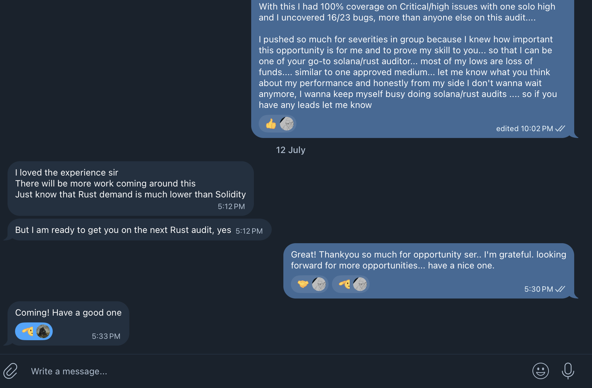

## About Me 
I'm **Smart Contract Security Researcher** specializing in **Rust/Solana audits**.

---

## Highlights

-  **Reputation score of 100** on [cantina→](https://cantina.xyz/u/chitresh)
-  Uncovered **60+ High/Medium** severity bugs
-  Secured **#2/248** in [Inclusive Competition](https://cantina.xyz/competitions/3eff5a8f-b73a-4cfe-8c54-546b475548f0) with **#4 Top-10** finishes in competitive audits overall
-  Having been placed on leaderboards of few solana competitions that I participated in & conducting few private audits (solo & with firms) I have gained decent understanding of this stack & with that I have audited +12 solana/rust codebases. Currently working with [PashovAuditGroup](https://x.com/PashovAuditGrp), [QuillAudits](https://x.com/QuillAudits_AI) & [AdevarLabs](https://x.com/AdevarLabs)

---

## Competitive Audits

|  Date |  Contest |  Findings |  Description |  Ranking |  Ecosystem / Language |
|------|-----------|-------------|----------------|------------|------------------------|
| 2025.01   | [Pump.Science](https://code4rena.com/audits/2025-01-pump-science) | **1M, 1L** | Amm | **#9/X** | Solana / Rust | 
| 2025.01   | [Soon SVM](https://cantina.xyz/competitions/08c2b0b4-8449-4136-82a2-7074ccdfffac) | **3M** | Infra/Bridge | **#7/449** | Solana / Rust |
| 2025.03   | [Reserve Protocol](https://cantina.xyz/competitions/8b94becd-54e7-41cd-88e6-caae7becc76a) | **1H, 1M** | Basket | **#5/237** | Solana / Rust |
| 2025.01   | [Inclusive Finance](https://cantina.xyz/competitions/3eff5a8f-b73a-4cfe-8c54-546b475548f0) | **15H, 2M** | Vault | **#2/248**  | Solana / Rust |

---

## Private Audits

|  Date |  Protocol     |  Findings           |  Description     |  Ecosystem / Language |  Provider       |  Report                                                                 |
|------|----------------|----------------------|-------------------|------------------------|------------------|--------------------------------------------------------------------------|
| 2025.06   | [PnP Exchange](https://pnp.exchange) | **1C, 2H, 3M, 3L** | Prediction market      | Solana / Rust      | Solo             | [Link](https://github.com/ctrusonchain/ctrusonchain/blob/main/reports/pnpreport.md) |
| 2025.06   | [Pyro Fun](https://pyro.fun/)        | **1H, 2M, 1L**         | Token launcher         | Solana / Rust      | QuillAudits       | *Not public*                                                               |
| 2025.07   | [BTR.fi](https://btr.fi/)            | **5C, 2H, 1M, 8L** | Vault / Staking        | Solana / Rust      | PashovAuditGroup  | *Not public*                                                               |
| 2025.07  | [Zync Protocol](https://zynklabs.xyz/) | **3M, 2L**        | Token transfer                | Solana / Rust      | QuillAudits           | *Not public*                                                               |
| 2025.08   | **Undisclosed**                | **2C, 4H, 8M, 2L**        | Privacy engine                | Solana / Rust      | QuillAudits          | *Not public*                                                               |
| 2025.08   | **Undisclosed**                | **5 & counting**     | Stablecoin               | Solana / Rust      | AdevarLabs         | *Not public*                                                               |

---

## Testimonials
**[Pashov](https://x.com/pashovkrum) ( Founder [@PashovAuditGroup](https://x.com/PashovAuditGrp) )**

**[Amar](https://x.com/amarfares_) ( Security Researcher )**
**[Nirlin](https://x.com/0xnirlin) ( Security Researcher [@AdevarLabs](https://x.com/AdevarLabs) )**

**[Darpit](https://x.com/proxima424) ( Founder [@Pnp exchange](https://x.com/predictandpump) )**

